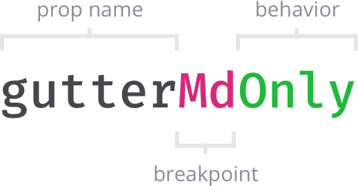

# Responsive props

## Introduction

Any prop alias is considered a responsive prop when its name is suffixed with a breakpoint name. Responsive props may also have an optional behavior specified.

## Declaration

To declare a responsive prop follow the next schema:

### **Prop name**

Any [Prop alias](prop-aliases.md) can be used as a responsive prop. Not all props are allowed as responsive props to preserve the ideological approach of layout composition.

### Breakpoint name

An optional name of the configured [breakpoint](breakpoints.md).

### **Behavior**

* `up` \(_Default_\) — Applies the given value from the specified breakpoint and up,
* `down` — Applies the given value from the specified breakpoint and down,
* `only` — Applies the given value only for the specified breakpoint.


Atomic layout is mobile-first. That means that by default responsive props are applied starting from the given breakpoint and **up**, unless different behavior is specified, or rewriting prop is met.


## Defaults

* Default breakpoint behavior is `up`,
* Default measurement unit for numeric prop values is `px`,
* When not suffixed, any prop value is applied for `xs` breakpoint and `up`.

## Examples

* `gutter` — Sets `grid-gap` for all breakpoints \(from `xs` and all the way up\), 
* `marginVerticalMd` — Applies `margin-top` and `margin-bottom` for `md` breakpoint and up,
* `placeItemsLgOnly` — Places the child items for `lg` breakpoint only.

